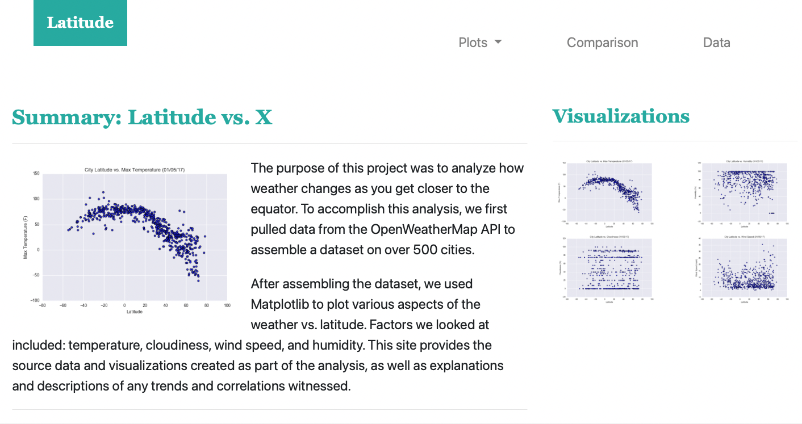
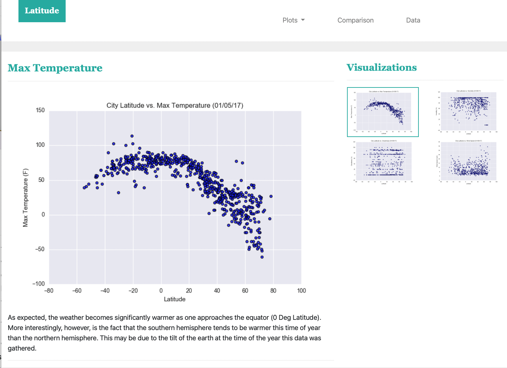
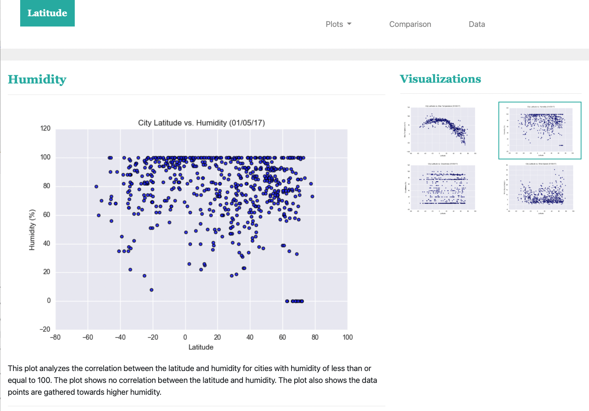
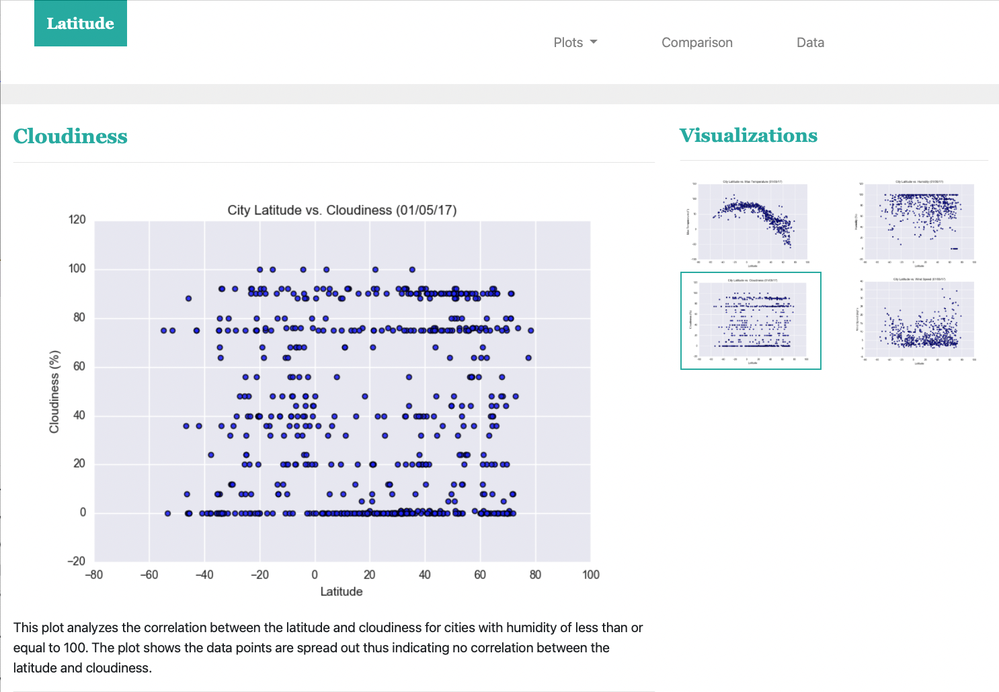
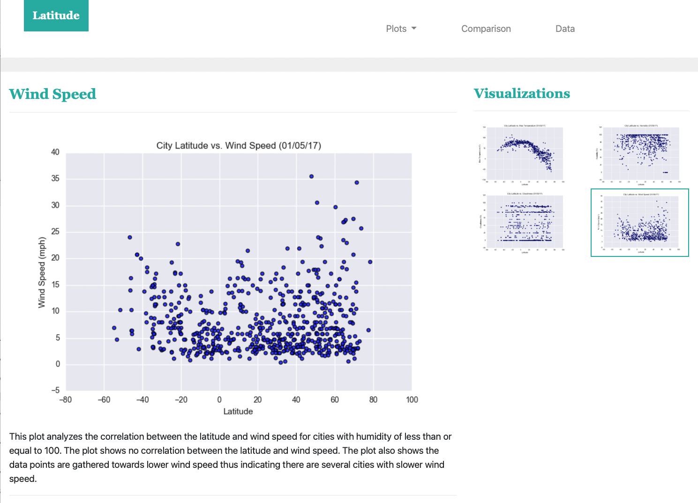
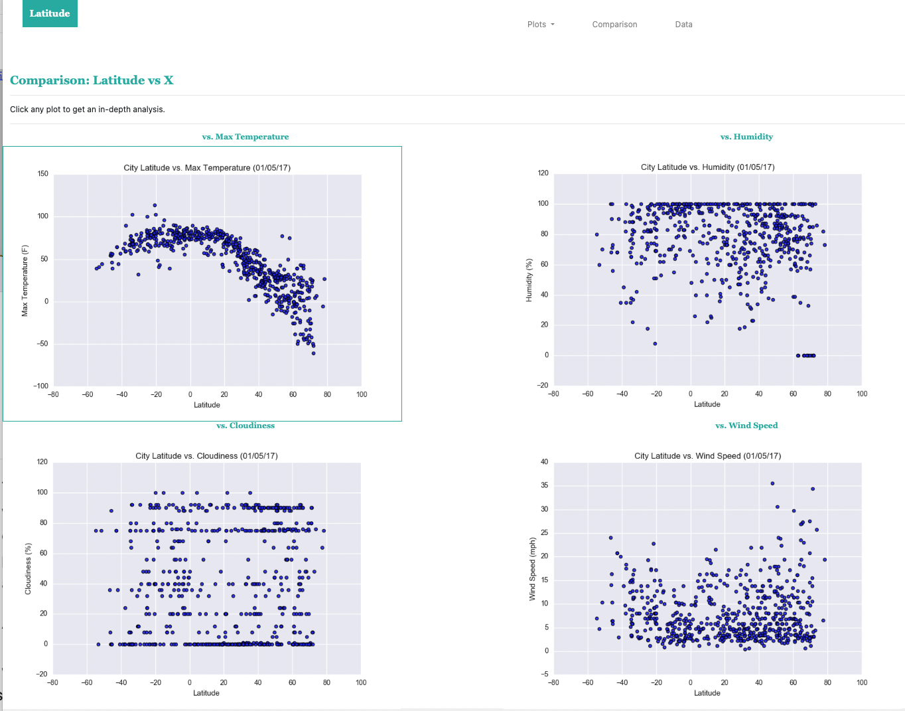
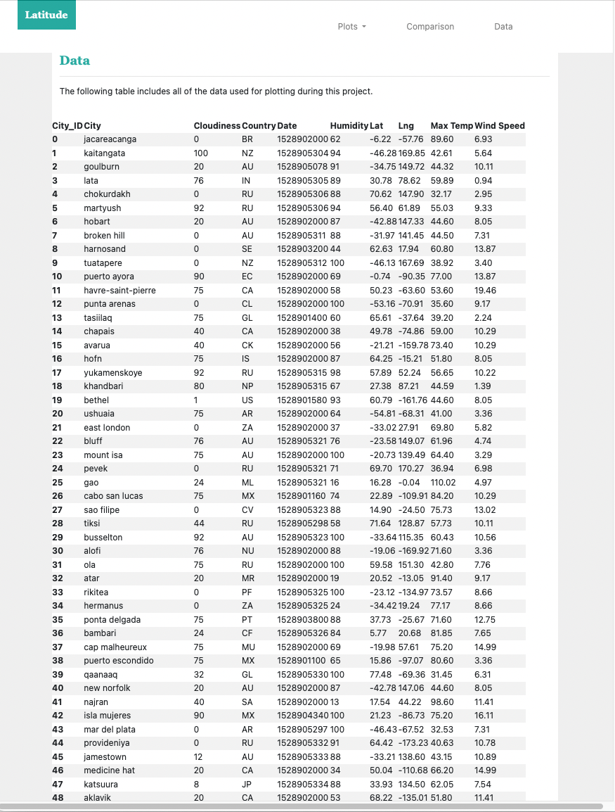

# Web Visualization Dashboard: Weather Data Analysis

Author: Rosie Gianan, gianr00@gmail.com

Website URL:     tbd

Build With: HTML, CSS, Bootstrap, pandas

## Goal:
Create a website to display the data visualizations results created in project “Weather data analysis”. 

## Solutions:
Build a website dashboard with individual pages for each data visualization plot and a way to navigate between them.  The pages contain the visualizations plot and descriptions. The website contains a page to provide a comparison of all the plots, along with another page to present the data used to build them.

At the top of every page, the website has a navigation menu with the following elements:
-    Name of the site on the left of the navigation bar, allowing users to return to the landing page from any page.
-    Dropdown menu on the right of the navigation bar, named "Plots," to provide links to each individual visualization page.
-    Links on the right: "Comparison," which links to the comparisons page, and "Data," which links to the data page.

The website consists of seven pages, including:
-    #### A landing page containing the links to each visualizations page and a sidebar containing preview images of each plot. Clicking an image should take the user to that visualization.

-    #### Four visualization pages,  each with the plot or visualization for the selected comparison (latitude vs: max temperature, humidity, cloudiness, or wind speed). 

-    #### A  comparisons page containing all of the visualizations on the same page so they can easily be compared with each other.

-    #### A data that displays a responsive table containing the data used in the visualizations.

